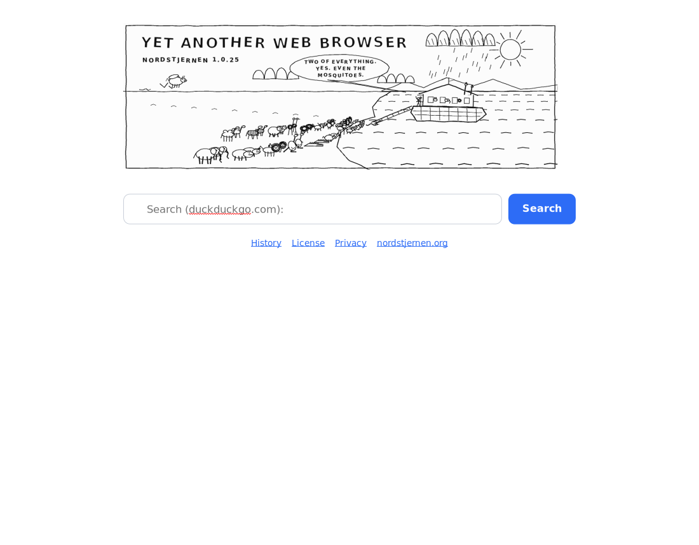

Nordstjernen web browser
========================

Nordstjernen is an web browser written from scratch in C,
focused on support for modern HTML, CSS and JavaScript standards.
It is built in Norway.



Desktop builds run on
[Windows](https://apps.microsoft.com/detail/9nw8t7w5z4pl), macOS, Linux,
FreeBSD and NetBSD. The same engine also powers
[Android](https://play.google.com/store/apps/details?id=org.nordstjernen.WebBrowser)
and iOS shells and a Java/JVM binding.

**Current release:** **1.0.25** (September 2026) — see [Changelog.md](Changelog.md).

**Standards.** Behaviour is measured against the spec text, section by
section, not against another browser. The walk-through of the in-scope
WHATWG HTML standard (§1–§16) in
[docs/HTML-compatibility.md](docs/HTML-compatibility.md) records **140 spec
rows fully implemented, 31 partial, 0 absent** (July 2026), besides a handful
that are non-goals by design: `embed`/`object` plugins, `frame`/`frameset`,
`applet`/`marquee`, telemetry, and AI-style web APIs.

**Security.** Each tab's engine runs in its own sandboxed process (seccomp +
Landlock on Linux) behind an IPC + shared-memory-framebuffer boundary. No JIT.

**Minimalism.** The core engine is about 185,000 lines of project C and
headers, excluding vendored libraries and generated assets — small enough for
one person to read and audit end-to-end.

See [northstar-browser-gpl](https://github.com/nordstjernen-web/northstar-browser-gpl)
for the GPL-licensed sibling project.


## Download

| Platform | Download |
|----------|----------|
| Windows | [Windows store](https://apps.microsoft.com/detail/9nw8t7w5z4pl) |
| Android | [Google Play](https://play.google.com/store/apps/details?id=org.nordstjernen.WebBrowser) |
| Source | [release tags](https://github.com/nordstjernen-web/nordstjernen-browser/tags) |

Windows 10 or later is required (the GTK 4 frontend links
DirectComposition). Every other platform builds from source — see
"Build" below and the per-platform install notes in
[docs/](docs/README.md).

## Browser features

- **HTML/CSS** — HTML is parsed by the in-tree lexbor engine; the CSS engine
  covers the modern cascade and CSSOM, Media Queries Level 4, container
  queries and units, flex, grid, transforms, gradients, animations and
  vertical writing modes.
- **Text layout** — desktop builds shape text with **ns-pango**, a Pango fork
  pinned as a meson subproject that caches finished glyph strings and font
  metrics across layouts, so measuring and painting a run reach HarfBuzz once
  instead of three times. Android and iOS link the system Pango;
  `-Dns-pango=disabled` builds that path on the desktop too.
- **JavaScript** on the QuickJS interpreter — DOM, Shadow DOM, observer APIs,
  Canvas 2D (`Path2D`, `ImageBitmap`, `DOMMatrix`), WebCrypto
  (`crypto.subtle` over OpenSSL), custom elements including customized
  built-ins (`is=` / `{extends}`), and the `Navigation` API for single-page
  routing. The engine binding is a build-time seam: an experimental **V8
  backend** (`-Djs_engine=v8`, external V8 monolith, never vendored) runs page
  scripts with live core DOM bindings while QuickJS stays the default — see
  [docs/V8.md](docs/V8.md).
- **Networking** over HTTP/2 with libcurl — HTTP/3 when the linked libcurl
  provides it — HSTS, CSP, subresource-integrity checks, partitioned cookies,
  speculative subresource loading, request coalescing and a `Vary`-aware HTTP
  cache. An in-tree **libnghttp2** transport backend is selectable at build
  time (`-Dhttp_backend=nghttp2`), with **HTTP/3 over QUIC** via ngtcp2 +
  nghttp3 + gnutls when present. Both backends fetch byte-identically, so the
  independent transports cross-check each other. See
  [docs/http-backends.md](docs/http-backends.md).
- **Images and graphics** — Wuffs decodes PNG/APNG, GIF, BMP, JPEG and lossy
  WebP; libwebp handles animated WebP; ICO and SVG are rendered in-engine,
  with optional AVIF support. The inline PDF viewer is left out of official
  builds (see below).
- **Media** — `<video>` plays **inline** for MPEG-1 (decoded in-tree by
  [pl_mpeg](https://github.com/phoboslab/pl_mpeg)) and, when FFmpeg's libav is
  present at build time, **WebM** (VP9/VP8 + Opus/Vorbis). MSE/`blob:`
  streaming and HLS/DASH manifests play through the `nordstjernen-video`
  helper, and a `<track default>` WebVTT file is drawn over the video. Other
  codecs render a poster and play overlay. See [docs/media.md](docs/media.md).
- **WebGL / WebGPU / WebAssembly** — WebGL 1/2 mapped onto OpenGL ES, on by
  default ([docs/webgl.md](docs/webgl.md)); experimental `navigator.gpu` over
  external wgpu-native, built only when that library is installed and gated
  behind `--enable-webgpu` ([docs/webgpu.md](docs/webgpu.md)); the full
  WebAssembly JS API over a vendored WAMR interpreter
  ([docs/webassembly.md](docs/webassembly.md)).
- **MathML** — a minimalist presentation-MathML renderer (`src/mathml.c`)
  laid out over Pango/Cairo and embedded inline on the text baseline.
- **Spell checking** — optional, via Enchant: misspelled words in editable
  text get a red wavy underline, honouring the `spellcheck` attribute.
- **Safe browsing** — a top-level navigation's host is checked against a local
  SHA-256 blocklist before it is fetched, entirely on-device; a match shows a
  full-page warning. Overridable via
  `~/.config/nordstjernen/safebrowsing.list`.
- **Process-per-tab** — each tab's engine runs in its own sandboxed
  `nordstjernen-renderer` process; the GTK app is a thin shell that blits the
  renderer's shared-memory framebuffer and forwards input over an IPC control
  channel, so a page can't take down the UI
  ([docs/tab-isolation.md](docs/tab-isolation.md)). `--single-process` runs
  every tab's engine in the shell process instead
  ([docs/single-process-mode.md](docs/single-process-mode.md)).
- **Privacy** — no telemetry or update pings, standards-compliant client
  hints, local-only safe browsing, partitioned cookies and a `--private`
  session mode.
- **UI** — tabs, bookmarks, find-in-page, save-to-PDF, JS console, settings,
  headless mode, and a C embedding API.
- **Java/JVM** — `org.nordstjernen.Nordstjernen` drives fetch / parse / layout
  / script / render from Java over a JNI bridge, or `RemoteBrowser` /
  `RemotePage` drive a separate renderer process so an engine crash can't take
  down the JVM. The fat jar is both the embedding library and a
  standalone Swing browser (`java -jar nordstjernen-java.jar <url>`). See
  [java/README.md](java/README.md).

## Build

```sh
sudo apt install build-essential pkg-config meson ninja-build \
    libgtk-4-dev libepoxy-dev libcurl4-openssl-dev libssl-dev libuchardet-dev \
    libpsl-dev libsqlite3-dev libseccomp-dev libwebp-dev libsdl2-dev
meson setup builddir && meson compile -C builddir
./builddir/src/gtk/nordstjernen
```

Windows, Fedora, openSUSE and macOS instructions are in
[docs/](docs/README.md); keyboard, mouse and touch controls are in
[docs/Controls.md](docs/Controls.md).

## Dependencies

Nordstjernen is an independent engine — no upstream browser code.

**Vendored in-tree**, built from the main tree with no submodules:
[lexbor](https://github.com/lexbor/lexbor) (HTML5 → DOM parser, CSS, and the
WHATWG URL module), [QuickJS](https://github.com/quickjs-ng/quickjs)
(quickjs-ng fork, no JIT), [WAMR](https://github.com/bytecodealliance/wasm-micro-runtime)
(WebAssembly interpreter), [Wuffs](https://github.com/google/wuffs)
(memory-safe image decoding), [pl_mpeg](https://github.com/phoboslab/pl_mpeg)
(MPEG-1 video + MP2 audio) and [minimp3](https://github.com/lieff/minimp3)
(MP3). The only setup-time download is
[ns-pango](https://github.com/nordstjernen-web/ns-pango), the text-shaping
fork; `-Dns-pango=disabled` links the system Pango and needs no network.

**Required system libraries:**

| Library | Min version | Role |
|---------|-------------|------|
| GTK 4 | **≥ 4.22.1 on Windows** (MSYS2 stock), ≥ 4.14 elsewhere (≥ 4.22 preferred) | UI toolkit, GSK renderer |
| GLib / GModule, Pango | (ship with GTK) | core types, dynamic module loading, text shaping |
| libepoxy | — | OpenGL/ES function dispatch for WebGL |
| libcurl | ≥ 8.5 (≥ 8.11 for WebSocket) | HTTP/2 networking, HSTS, cookies, native WebSocket |
| OpenSSL (libcrypto) | — | WebCrypto (`crypto.subtle`) |
| uchardet | — | charset detection |
| libpsl | — | public-suffix list for cookie scoping |
| SQLite | — | IndexedDB persistent storage |
| libwebp | — | animated, lossless and fallback WebP decoding |
| SDL2 | — | audio output for the `nordstjernen-audio` helper |
| libseccomp | — (Linux only) | syscall sandbox; no-op on macOS/Windows |

**Optional**, auto-detected or build-time-selected:
[FFmpeg](https://github.com/FFmpeg/FFmpeg) libav\* (inline WebM playback —
required on Linux and Windows, auto-detected on macOS), libavif (AVIF
images), Enchant (spell checking), fontconfig / pangoft2 (extra font
backends), [libnghttp2](https://github.com/nghttp2/nghttp2) (the
in-tree HTTP/2 backend), [ngtcp2](https://github.com/ngtcp2/ngtcp2) +
[nghttp3](https://github.com/ngtcp2/nghttp3) + GnuTLS (HTTP/3 over QUIC inside
it), [wgpu-native](https://github.com/gfx-rs/wgpu-native) (experimental
WebGPU) and a [V8](https://v8.dev/) monolith (experimental
`-Djs_engine=v8`).

**PDF viewing is off in official builds.** The inline PDF viewer
(`src/pdf.c`) renders through [Poppler](https://poppler.freedesktop.org/)'s
poppler-glib, which is licensed GPL-2.0-or-later, and a binary that links it
is subject to the GPL (see [THIRD-PARTY-LICENSES.md](THIRD-PARTY-LICENSES.md)).
The released binaries and packages therefore leave it out: opening a PDF shows
a page with a link that downloads the file for a PDF reader. For a private
build with the viewer, install poppler-glib's development package and
configure with `meson setup builddir -Dpdf=enabled`.

## License

Nordstjernen Source License v1.0 — use, modify and redistribute freely,
except as a competing browser; each release becomes MIT after ten years.
See [License.md](License.md). Commercial licenses by agreement. It is
inspired by the [Functional Source License](https://fsl.software/).

Project home: <https://nordstjernen.org> · Copyright 2026 Andreas Røsdal ·
[Join the Discord](https://discord.gg/4W959nW5vF)

## Builds
[](https://github.com/nordstjernen-web/nordstjernen-browser/actions/workflows/linux.yml)
[](https://github.com/nordstjernen-web/nordstjernen-browser/actions/workflows/macos.yml)
[](https://github.com/nordstjernen-web/nordstjernen-browser/actions/workflows/windows.yml)
[](https://github.com/nordstjernen-web/nordstjernen-browser/actions/workflows/android.yml)
[](https://github.com/nordstjernen-web/nordstjernen-browser/actions/workflows/java.yml)
[](https://github.com/nordstjernen-web/nordstjernen-browser/actions/workflows/codeql.yml)
[](https://semgrep.dev/orgs/nordstjerna/projects/6111979)


